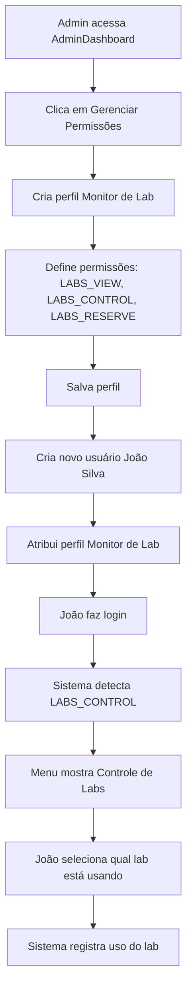

# 🔐 Sistema de Permissões Granulares - EtecNotes

## 📋 Visão Geral

Sistema completo de gerenciamento de permissões granulares que permite ao **Administrador Total** criar perfis personalizados com controle fino sobre o que cada usuário pode fazer no sistema.

---

## 🎯 Casos de Uso Principais

### 1. **Monitor de Laboratório** 
**Problema:** Alunos responsáveis por laboratórios após 16h precisam controlar qual lab está sendo usado.

**Solução:** Perfil "Monitor de Lab" com permissão especial `LABS_CONTROL`

```javascript
Permissões do Monitor:
✅ LABS_VIEW - Ver laboratórios disponíveis
✅ LABS_CONTROL - Selecionar e controlar qual lab está em uso
✅ LABS_RESERVE - Fazer reservas
✅ Permissões básicas de aluno
```

### 2. **Representante de Turma**
Aluno com poderes extras para coordenar eventos da turma.

```javascript
Permissões do Representante:
✅ EVENTS_CREATE - Criar eventos da turma
✅ NOTIFICATIONS_SEND - Enviar avisos para turma
✅ Permissões básicas de aluno
```

### 3. **Professor Coordenador**
Professor com poderes administrativos extras.

```javascript
Permissões do Coordenador:
✅ Todas permissões de professor
✅ USERS_VIEW - Ver lista de alunos
✅ CLASSES_CREATE - Criar novas turmas
✅ CLASSES_DELETE - Remover turmas
```

---

## 📁 Estrutura do Sistema

### Arquivos Criados

```
src/
├── constants/
│   └── permissions.js          # Definição de todas as permissões
├── hooks/
│   └── usePermissions.js       # Hook para verificar permissões
├── components/
│   └── pages/
│       └── admin/
│           └── PermissionsManager.jsx  # Interface de gerenciamento
├── examples/
│   └── PermissionsUsageExamples.jsx   # Exemplos de uso
```

---

## 🔑 Permissões Disponíveis

### 🖥️ **Laboratórios**
| Código | Nome | Descrição |
|--------|------|-----------|
| `LABS_VIEW` | Visualizar Laboratórios | Ver lista de labs disponíveis |
| `LABS_RESERVE` | Reservar Laboratório | Fazer reserva de lab |
| `LABS_CONTROL` | **Controlar Labs** | **Selecionar qual lab está usando (Monitor)** |
| `LABS_MANAGE` | Gerenciar Labs | Criar/editar/excluir labs |
| `LABS_APPROVE` | Aprovar Reservas | Aprovar ou rejeitar reservas |

### 👥 **Usuários**
| Código | Nome | Descrição |
|--------|------|-----------|
| `USERS_VIEW` | Visualizar Usuários | Ver lista de usuários |
| `USERS_CREATE` | Criar Usuários | Adicionar novos usuários |
| `USERS_EDIT` | Editar Usuários | Modificar dados de usuários |
| `USERS_DELETE` | Excluir Usuários | Remover usuários |
| `USERS_PERMISSIONS` | **Gerenciar Permissões** | **Criar perfis e atribuir permissões** |

### 📚 **Turmas**
| Código | Nome | Descrição |
|--------|------|-----------|
| `CLASSES_VIEW` | Visualizar Turmas | Ver turmas cadastradas |
| `CLASSES_CREATE` | Criar Turmas | Adicionar novas turmas |
| `CLASSES_EDIT` | Editar Turmas | Modificar turmas |
| `CLASSES_DELETE` | Excluir Turmas | Remover turmas |

### 📅 **Eventos**
- `EVENTS_VIEW`, `EVENTS_CREATE`, `EVENTS_EDIT`, `EVENTS_DELETE`

### 🔔 **Notificações**
- `NOTIFICATIONS_VIEW`, `NOTIFICATIONS_SEND`

### 📝 **Anotações**
- `NOTES_VIEW_OWN`, `NOTES_VIEW_ALL`, `NOTES_CREATE`, `NOTES_EDIT_OWN`, `NOTES_DELETE_OWN`

### 💬 **Chat**
- `CHAT_ACCESS`, `CHAT_MODERATE`

### 📊 **Relatórios**
- `REPORTS_VIEW`, `REPORTS_GENERATE`

### ⚙️ **Configurações**
- `SETTINGS_VIEW`, `SETTINGS_EDIT`

---

## 👤 Perfis Pré-Definidos

### 🛡️ **ADMINISTRADOR** (God Mode)
- **Todas as permissões** do sistema
- Pode criar/editar/excluir qualquer coisa
- Pode gerenciar permissões de outros usuários

### 💼 **SECRETARIA** (SECRETARIA)
- Gestão operacional **SEM** CRUD de usuários
- Pode: gerenciar turmas, eventos, notificações, labs
- Não pode: criar/editar/excluir usuários

### 📖 **PROFESSOR**
- Gerenciar turmas e disciplinas
- Criar eventos e notificações
- Reservar e gerenciar laboratórios
- Moderar chat

### 🎓 **ALUNO**
- Visualizar conteúdo
- Criar anotações pessoais
- Participar do chat
- Ver eventos e notificações

### 🖥️ **MONITOR_LAB** (Novo!)
- **Todas permissões de Aluno**
- **+ LABS_CONTROL** - Controlar laboratórios
- **+ LABS_RESERVE** - Fazer reservas
- Horário: Após 16h

---

## 🚀 Como Usar

### 1️⃣ **Administrador Cria Perfil Customizado**

```javascript
// No AdminDashboard, clicar em "Gerenciar Permissões"
// Criar novo perfil com as permissões desejadas

const monitorLabProfile = {
  id: 'MONITOR_LAB',
  name: 'Monitor de Laboratório',
  description: 'Aluno responsável por labs após 16h',
  color: '#FF9800',
  icon: 'Monitor',
  permissions: [
    'LABS_VIEW',
    'LABS_CONTROL',  // Permissão especial!
    'LABS_RESERVE',
    // ... outras permissões de aluno
  ]
}
```

### 2️⃣ **Criar Usuário com Perfil**

```javascript
// Ao criar um novo usuário no AdminDashboard
const newUser = {
  name: 'João Silva',
  email: 'joao.silva@etec.sp.gov.br',
  role: 'aluno',
  profile: 'MONITOR_LAB',  // Atribuir o perfil
  permissions: [...] // Permissões do perfil
}
```

### 3️⃣ **Verificar Permissões no Código**

```javascript
import { usePermissions } from '../hooks/usePermissions'

function LabsControl() {
  const { can } = usePermissions()
  
  return (
    <>
      {/* Todos podem ver */}
      {can('LABS_VIEW') && <LabsList />}
      
      {/* Apenas monitores */}
      {can('LABS_CONTROL') && (
        <div className="monitor-controls">
          <h3>Controles de Monitor</h3>
          <select>
            <option>Lab 1</option>
            <option>Lab 2</option>
          </select>
          <button>Iniciar Uso</button>
        </div>
      )}
    </>
  )
}
```

---

## 💡 Exemplos Práticos

### Exemplo 1: Menu Dinâmico

```javascript
const MenuItem = ({ path, label, permission }) => {
  const { can } = usePermissions()
  
  if (permission && !can(permission)) {
    return null // Não mostrar se não tem permissão
  }
  
  return <Link to={path}>{label}</Link>
}

// Uso:
<MenuItem path="/labs/control" label="Controle de Labs" permission="LABS_CONTROL" />
```

### Exemplo 2: Botão Condicional

```javascript
function ActionButton() {
  const { can } = usePermissions()
  
  if (can('USERS_DELETE')) {
    return <button className="btn-danger">Excluir Usuário</button>
  }
  
  if (can('USERS_EDIT')) {
    return <button className="btn-primary">Editar Usuário</button>
  }
  
  return <button className="btn-secondary">Ver Detalhes</button>
}
```

### Exemplo 3: Proteção de Rota

```javascript
<ProtectedRoute requiredPermission="LABS_CONTROL">
  <MonitorDashboard />
</ProtectedRoute>
```

---

## 📊 Fluxo de Criação de Monitor de Lab



---

## 🎨 Interface do Gerenciador de Permissões

### Funcionalidades:

✅ **Visualizar Perfis Existentes**
- Lista de todos os perfis com ícones coloridos
- Ver detalhes das permissões de cada perfil
- Filtrar e buscar perfis

✅ **Criar Perfil Customizado**
- Escolher nome, descrição, cor e ícone
- Selecionar permissões por categoria
- Marcar/desmarcar todas de uma categoria
- Preview em tempo real

✅ **Editar Perfis**
- Modificar perfis existentes (exceto padrões)
- Duplicar perfil para criar variação

✅ **Excluir Perfis**
- Remover perfis customizados
- Perfis padrões não podem ser excluídos

---

## 🔒 Segurança

### Validação no Backend

```javascript
// Backend deve SEMPRE validar permissões
app.delete('/api/users/:id', async (req, res) => {
  const userPermissions = req.user.permissions
  
  if (!userPermissions.includes('USERS_DELETE')) {
    return res.status(403).json({ 
      error: 'Permissão negada' 
    })
  }
  
  // Processar delete...
})
```

### Validação no Frontend

```javascript
// Frontend usa permissões para UX
// Mas backend SEMPRE valida!
const { can } = usePermissions()

if (can('USERS_DELETE')) {
  // Mostrar botão de excluir
  // Backend ainda vai validar quando clicar
}
```

---

## 📖 API do Hook `usePermissions`

```javascript
const {
  can,          // (permission) => boolean
  canAny,       // ([permissions]) => boolean
  canAll,       // ([permissions]) => boolean
  isAdmin,      // () => boolean
  getRole,      // () => string
  getPermissions, // () => string[]
  user          // Objeto do usuário
} = usePermissions()
```

### Métodos:

#### `can(permission)`
Verifica se tem UMA permissão específica.
```javascript
if (can('LABS_CONTROL')) {
  // Usuário pode controlar labs
}
```

#### `canAny([permissions])`
Verifica se tem PELO MENOS UMA das permissões.
```javascript
if (canAny(['USERS_EDIT', 'USERS_DELETE'])) {
  // Pode editar OU excluir
}
```

#### `canAll([permissions])`
Verifica se tem TODAS as permissões.
```javascript
if (canAll(['LABS_VIEW', 'LABS_CONTROL'])) {
  // Tem ambas as permissões
}
```

#### `isAdmin()`
Verifica se é administrador total.
```javascript
if (isAdmin()) {
  // Mostrar painel de admin
}
```

---

## 🎯 Benefícios

### ✅ Para Administradores
- Controle fino sobre o que cada usuário pode fazer
- Criar perfis personalizados sem código
- Adaptar sistema para necessidades específicas da escola

### ✅ Para Desenvolvedores
- Sistema modular e extensível
- Fácil adicionar novas permissões
- Código limpo e manutenível

### ✅ Para Usuários
- Apenas veem o que podem usar
- Interface adaptada às suas permissões
- Experiência personalizada

---

## 🚀 Próximos Passos

1. **Integração com Backend**
   - Salvar perfis no banco de dados
   - Validar permissões em cada endpoint
   - Sincronizar permissões em tempo real

2. **Auditoria**
   - Registrar quem criou/editou permissões
   - Log de acessos negados
   - Relatório de uso de permissões

3. **Permissões Temporárias**
   - Permissões com data de expiração
   - Permissões por horário (ex: Monitor após 16h)
   - Permissões por IP/localização

4. **Interface Melhorada**
   - Arrastar e soltar permissões
   - Templates de perfis
   - Importar/exportar perfis

---

## 📞 Suporte

Para dúvidas sobre o sistema de permissões:
- Ver exemplos em: `src/examples/PermissionsUsageExamples.jsx`
- Documentação das permissões: `src/constants/permissions.js`
- Hook de uso: `src/hooks/usePermissions.js`

---

## 🎉 Resumo

O sistema de permissões granulares permite que o **Administrador Total**:

1. ✅ Crie perfis customizados (ex: Monitor de Lab)
2. ✅ Atribua permissões específicas a cada perfil
3. ✅ Controle o que cada usuário pode ver e fazer
4. ✅ Adapte o sistema para necessidades específicas
5. ✅ Gerencie tudo através de uma interface visual

**Caso de uso principal resolvido:** 
Alunos monitores agora podem controlar laboratórios após 16h através da permissão `LABS_CONTROL`! 🎯
